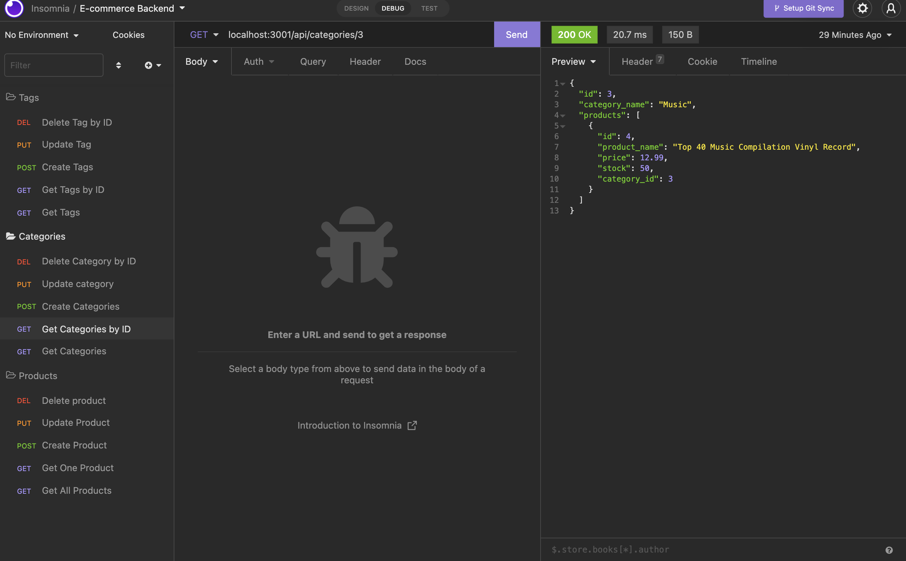
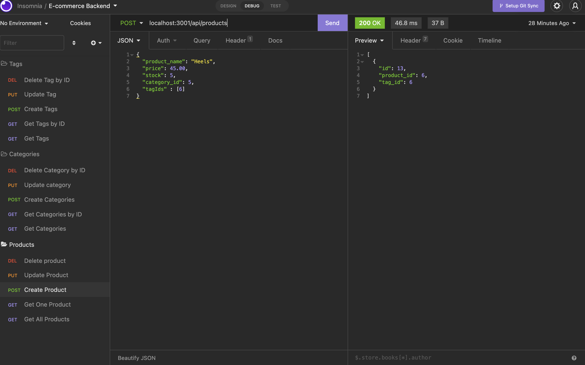
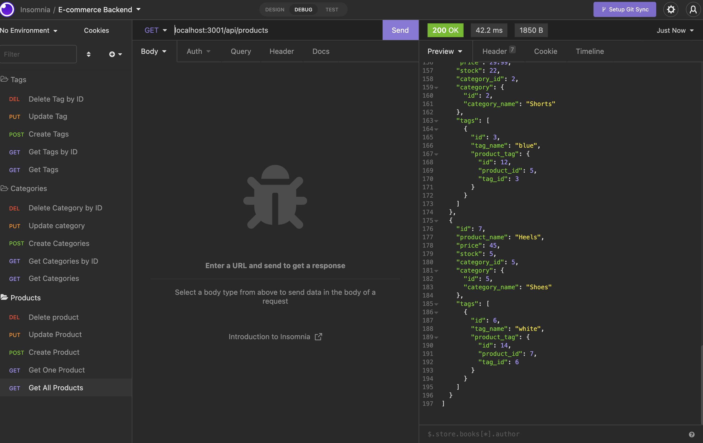
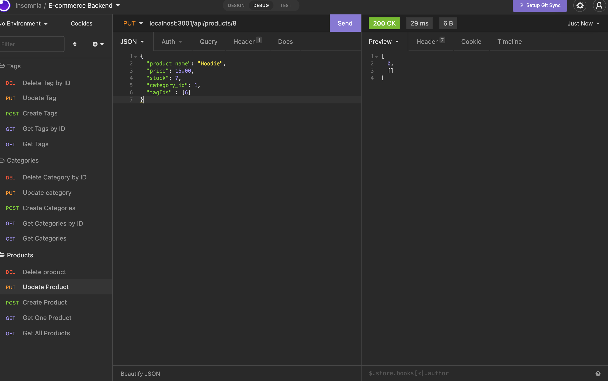

# E-commerce-back-end

# Why did I build this project?

To build the back end for an e-commerce site by working with Express.js API to use Sequelize to interact with a MySQL database. This application shows how to create a database with models and associations using mySQL. Then, as seen in my walkthrough video, it shows how to use API Routes to conduct RESTful CRUD tasks excuted using Insomnia.

## User Story

```md
AS A manager at an internet retail company
I WANT a back end for my e-commerce website that uses the latest technologies
SO THAT my company can compete with other e-commerce companies
```

## Acceptance Criteria

```md
GIVEN a functional Express.js API
WHEN I add my database name, MySQL username, and MySQL password to an environment variable file
THEN I am able to connect to a database using Sequelize
WHEN I enter schema and seed commands
THEN a development database is created and is seeded with test data
WHEN I enter the command to invoke the application
THEN my server is started and the Sequelize models are synced to the MySQL database
WHEN I open API GET routes in Insomnia for categories, products, or tags
THEN the data for each of these routes is displayed in a formatted JSON
WHEN I test API POST, PUT, and DELETE routes in Insomnia
THEN I am able to successfully create, update, and delete data in my database
```

# To access this project the following links are provided:

To access Github Repository

1. https://github.com/Farhiya1/E-commerce-back-end.git

To access Application Demo via Link.

2. https://drive.google.com/file/d/1nvzp_crbm7imQ1vlUn1MS1CmNvHexAr6/view?usp=sharing

# Screenshot of application)

1. Screenshot displaying Get product by id Request



2. Screenshot displaying Create Product by Post Request and new product added to the rest of thr products.





3. Screenshot displaying Put request with product being updated by id.



# References

1. https://www.npmjs.com
2. https://www.w3schools.com/nodejs/nodejs_filesystem.asp
3. https://www.freecodecamp.org/news/how-to-write-a-good-readme-file/
4. https://www.npmjs.com/package/mysql2
5. https://www.npmjs.com/package/sequelize
6. https://www.npmjs.com/package/dotenv
7. https://www.w3schools.com/js/js_api_fetch.asp
8. https://developer.mozilla.org/en-US/docs/Web/JavaScript/Reference/Statements/for-await...of
